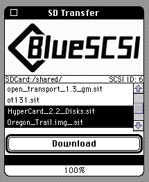

# BlueSCSI Transfer Utility
Backup your data before testing, this is a BETA!

  

## What is it?

BlueSCSI Toolbox is a set of 68k apps for Macintosh. The BlueSCSI Transfer Utility is the first app in a suite.

It's solving an all too common problem - how do you get files from the Macintosh Garden or anywhere to your vintage mac. Not everyone has a bridge machine, a network card, the ability to write disks, or the know how to get an emulator setup - they just want their mac to work! We want to make the process of getting Oregon Trail onto your Mac Plus, or Open Transport to your Quadra as easy as drag and drop.

As the name suggests the BlueSCSI SD Transfer Utility allows you to place those files you download on your modern computer directly on the SD card in a shared directory. Once you boot up the vintage computer you can then Download files from the SD card to your Mac. We'll even try to fix the file type and creator for you.

You can also upload files from your vintage mac to your SD card to backup those Claris documents or Quicktake images from the 90's.

## Prepare your BlueSCSI

Download the latest release: [Beta 1](https://github.com/erichelgeson/BlueSCSI-Toolbox/releases/download/v20220927-BETA1/Beta1.zip)

### If the version in LOG.txt ends in -USB

Flash `BlueSCSI-v1.1-20220927-STM32F1-USB-XFER_B1.bin` with [QMK](https://github.com/qmk/qmk_toolbox/releases/tag/0.2.2) (mac/win)

* Open QMK Toolbox
* (On Windows) Tools -> Install Drivers
* File -> Open -> Select the file.
* Click AutoFlash
* Plug in the BlueSCSI via USB and it will update.
  - Note on some BluePills flashing can take over a minute.

### If it does **not** end in -USB

Flash `BlueSCSI-v1.1-20220927-STM32F1-XFER_B1.bin` with an STLinkV2.

https://github.com/erichelgeson/BlueSCSI/wiki/Flashing-(Advanced) 

## Copy the HD1-Beta1.hda to your SD Card

This image contains just the Utility. Make sure to assign it to a free SCSI ID.

## Create a "shared" folder on the SD Card

On the same SD Card you copied the image to, create a folder named `shared` (lower case). You can drop some files in here you would like to transfer to your

* You will need another image or drive with a bootable Mac OS on it (Compatible with 6.0.8 through 9.2, 68k or PPC)
  - You can copy the app to that image once booted.
* Copy files to and from your Vintage Mac!
* Enjoy! - Checkout Macintosh Garden for things to transfer to your Mac

## Issues, bugs, features

* Github https://github.com/erichelgeson/BlueSCSI-Toolbox 
* TinkerDifferent https://tinkerdifferent.com/
* OpenRetroSCSI Discord https://discord.gg/GKcvtgU7P9

### Known Issues

* If sd:/shared folder doesn’t exist it defaults to the root of the sd (bug)
* Folders are currently not supported
* Uploading files greater than 15MB may halt or show incorrect state.

### Reporting issues

* The machine you used, OS, etc. Try with extensions off
* A photo or video of the problem if applicable
* If it is a crash, install macsbug and take a photo of the stacktrace

### Reporting feedback

* Be constructive, give opinion
* Does this remind you of an app that would have actually existed back in the day (in style)
* Any inconsistencies or typos
* I wish it could also do this

## License

BlueSCSI Transfer Utility is copyright Eric Helgeson 2022. BlueSCSI name is Trademarked by Eric Helgeson. You may not modify or distribute this app.
